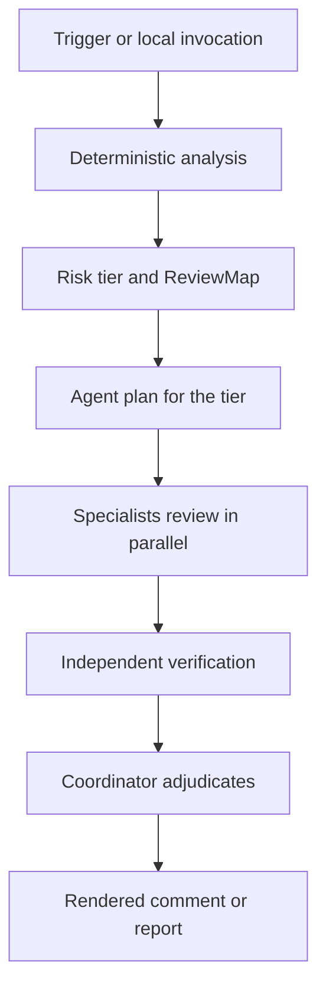

# Architecture

## Lifecycle

One shared deadline bounds every stage. Any failure produces `incomplete`, never a silent pass.

## Deterministic analysis first

Before any model runs, SAKRE measures the change with pinned native tools: SCC reports size, complexity, and dryness per file; CCCC reports function complexity.

Exact tool flags (for reproducibility)

Both tools run with fixed flags that ignore local config, so two runs of the same refs produce the same numbers:

- SCC: `scc --by-file --format json --no-cocomo -a --cognitive --no-config --no-gitignore --no-ignore --no-scc-ignore --no-gitmodule -- .`
- CCCC: `cccc --no-config --no-ignore --no-cache -- .`

Classification labels each path (lockfile, vendor, generated, docs, tests, sensitive areas). Noise stays out of volume math, and `review.exclude` stays out of agent context. See [Configuration](configuration.md) for both.

The output is the ReviewMap, the JSON document agents receive: revisions, coverage, languages, files with classification and risk, functions with match data, change distributions, and up to 10 ranked hotspots (code growth, complexity growth, dryness regression, new functions, parse failures). Hotspots rank attention only. They never set scope or score.

## Orchestration

The risk tier selects the agent plan: `lite` runs correctness and tests; `standard` adds conventions and maintainability; `hard` adds security and performance. Escalation signals can add specialists, for example performance on large changes. Each specialist receives the shared context, its role prompt, the ReviewMap projection sized to its job, and the diff last. Custom roles and plans are configuration, not code changes.

## Verification

The verifier re-checks each `Blocker` and `Important` finding in isolation, on its own session, with a refute-by-default stance: it tries to disprove the finding from source and confirms only what the source proves. `Minor` findings skip verification and are labeled as unverified, never dropped silently. A verifier failure leaves the finding `unverified` and the review `incomplete`.

The coordinator sees full candidates with matching hunks but never raw guidance, only its provenance. Each final finding must reference known candidate ids; unknown ids are skipped as `invalid-output`. The verdict follows the confirmations: a confirmed Blocker means `changes_required`, confirmed non-blockers mean `comments`, otherwise `clean`. Any failure or coverage loss means `incomplete` with a null verdict.

## Providers and runtime

SAKRE ships as a Bun-compiled binary per platform with the engine, ripgrep, SCC, and CCCC embedded. Runners and laptops install no packages. The engine drives agents through OpenCode: any model in the OpenCode catalogue is routable per agent and per tier, with `model#variant` overlays. Model routing resolves before the first provider call and fails closed when a route is missing.

## Security and isolation

- Configuration loads from the protected base commit, never the pull request head.
- Agents run deny-by-default: read-only workspace plus result submission. Network fetch runs only with `tools.web` or `tools.context7` enabled.
- Comment text and guidance files are untrusted prompt content. They focus investigation and cannot change options or suppress findings.
- Credentials resolve from environment, then the SAKRE store, then the OpenCode store. The Action publishes a comment and never approves or merges.
